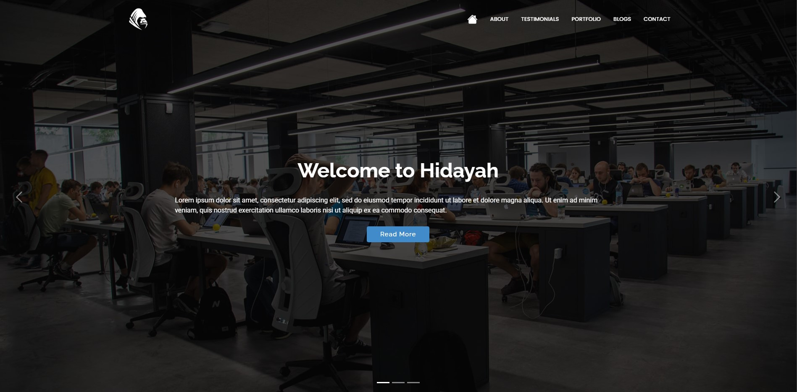

# Kurumsal Web Uygulaması

Bu proje, Express.js ve EJS teknolojilerini kullanarak geliştirilmiş tam işlevsel bir kurumsal web uygulamasıdır. Hem kamuya açık sayfalara sahip hem de admin paneli üzerinden yönetilebilen güçlü özellikler sunar. Kullanıcılar, belirli içeriklere erişim sağlarken, yönetici kullanıcılar ise içerik ve siteyi yönetmek için özel paneli kullanabilirler.

## Kütüphaneler

Kullanılan kütüphaneleri `package.json` dosyasındaki `dependencies` içerisinde görebilirsiniz.

## Kurulum

### 1. .env Yapılandırması

Dosya dizininde ana dizinde `.env` dosyasını oluşturun ve `.env_exp` dosyasındaki verileri eksiksiz bir şekilde doldurun

### 2. Veri Tabanı

Bu projede PostgreSQL veri tabanı ve ORM yapısı olarak da Sequelize kütüphanesi kullanılmıştır. Eğer projeyi lokal makinenizde kullanmak istiyorsanız bilgisayarınızda Nodejs son sürümü (v20.16.0) ve PostgreSQL veri tabanı kurulu olması gerekmektedir. Kurulumları tamamladıktan sonra `sqls.sql` dosyasında yer alan SQL sorgusunu PostgreSQL içerisinde çalıştırabilirsiniz.

### 3. Projeyi Başlatma

Tüm kurulumları yaptıktan sonra `npm run dev` komutu ile projeyi başlatabilirsiniz.

Profilimde yer alan iletişim bilgileri benimle iletişime geçebilirsiniz.

## Kurumsal Sayfalara ve Admin Paneline Erişim.

Projenin `3000` portunda `localhost` olarak ayarlanırsa sayfa URL bilgileri aşağıdakiler gibi olcaktır.

Kurumsallar için:

1. Home Page: http://localhost:3000
2. About Us: http://localhost:3000/about
3. Testimonials: http://localhost:3000/testimonials
4. Portfolios: http://localhost:3000/portfolios
5. Blogs: http://localhost:3000/blogs
6. Contact: http://localhost:3000/contact

Admin Paneli için:

1. Admin Home Page: http://localhost:3000/admin/home
2. Admin Signup Page: http://localhost:3000/admin/signup
3. Admin Signin Page: http://localhost:3000/admin/signin
4. Blogs Page: http://localhost:3000/admin/blogs

   ...
